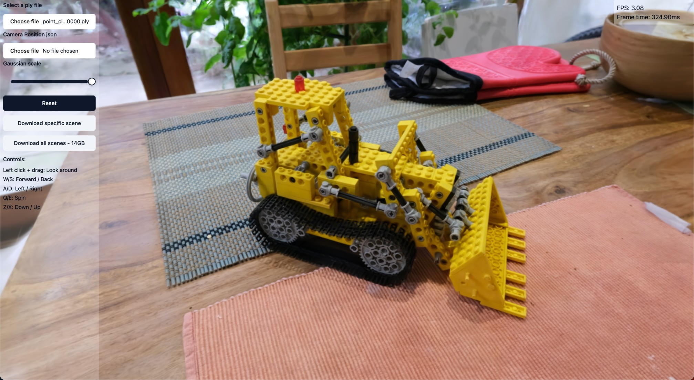

# 3D Gaussian splatting in WebGPU

Within this repository, you'll discover an implementation of [3D Gaussian Splatting for Real-Time Radiance Field Rendering](https://repo-sam.inria.fr/fungraph/3d-gaussian-splatting/). This technique enables the real-time visualization of 3D scenes from photographs. The original project employed CUDA technology, but my aim was to create a web-accessible viewer that faithfully maintains the essence of the author's work by leveraging compute shaders. Currently the only web technology that offers compute shaders is WebGPU which is what was used for this implementation.

A significant advantage of employing the compute shader method is the efficient sorting of splats directly on the GPU, setting it apart from other WebGL viewers. This capability enables us to sort splats in every frame, closely mirroring the approach described in the original paper. As a result, we eliminate the issue of splats occasionally rendering out of order for a few frames when the camera moves rapidly.

I've leveraged [cvlab-epfl's implementation](https://github.com/cvlab-epfl/gaussian-splatting-web) as the foundation for this repository, with the bulk of the code responsible for loading, parsing, and packing Gaussian data as well as the gauss-math components and scene camera originating from their work. Additionally, I'd like to acknowledge [Fei Yang's implementation](https://github.com/fynv/webgpu_math) of radix sort in WebGPU, which served as a valuable reference. Special thanks go to [Mykhailo Moroz](https://twitter.com/Michael_Moroz_) for providing invaluable insights during the optimization of the radix sort.

Online demo: [https://splatting.marcussvensson.com](https://splatting.marcussvensson.com)



#### Future work and opportunities:

- Boost the performance of the radix sort algorithm.

- Optimize the rasterization process, which currently consumes a significant portion of processing time and is on par with the sorting phase in terms of performance.

- Enhance the optimization of buffer packing for reduced memory usage and overall improved performance.

- Implement more advanced culling techniques for splats to enhance efficiency.

- Enhance the efficiency of computing the prefix sum for tile-splat intersections.

- Enable support for more efficient file formats, such as the .splat file format utilized in [mkkellogg's implementation](https://github.com/mkkellogg/GaussianSplats3D).

- Explore the possibility of breaking down the sorting process into two phases. Given the relatively low total number of tiles, consider implementing a more efficient counting sort for tile indexing and subsequently sorting the depth per tile in the second phase. A possible approach might involve [this](https://on-demand.gputechconf.com/gtc/2014/presentations/S4117-fast-fixed-radius-nearest-neighbor-gpu.pdf).

- A potentially superior approach would be to insert the intersections from a tile perpective from the beginning, scattering on the correct indeces, effectively reducing the problem to pure depth sorting per tile.

- A rewrite of the pipeline in a more holistic manner to increase readability and maintainability. 

## A few words on performance

This implementation falls significantly short of optimal performance, leaving much to be desired in terms of frame times. For example, on a Macbook M1, most scenes achieve a mere 3-8 frames per second, while on a 4090ti, they generally range between 30-60 frames per second.

With that said there's still plenty of room for optimization, and I'm confident that the performance will be significantly improved with further work. I've included a few ideas for future work in the section above.

If you want to access precise timings for individual segments of the GPU pipeline, I've incorporated timestamps for different phases. This feature is currently in an experimental state within the web browser and is concealed behind a flag. To activate this flag, you can launch Chrome with the following command: ```--enable-dawn-features=allow_unsafe_apis```. Subsequently, you can view the logs in the console output.

## Develop

Navigate to the code directory and run

```
npm install

npm run dev
```

The dev server can be found locally at [localhost:5173](http://localhost:5173)


## Building

Navigate to the code directory and run

```
npm install

npm run build
```

To view the build locally, run

```
npm run preview
```

The demo will be accessible locally at [localhost:4173](http://localhost:4173)


## Usage

This implementation relies on the user having the required data available locally.

Inrias scene data is available here (14GB): [https://repo-sam.inria.fr/fungraph/3d-gaussian-splatting/datasets/pretrained/models.zip](https://repo-sam.inria.fr/fungraph/3d-gaussian-splatting/datasets/pretrained/models.zip)

If you don't want to download all that data, I have some select scenes available in my [Google drive](https://drive.google.com/drive/folders/1WXCpR3kshQt2jmOtuCBsHKfzt1IMqey2).

I also included download links for the data in the demo page.

## Caveats

In certain scenarios, particularly when viewing scenes with a high splat count, the total number of tile intersections can surpass the capacity of the GPU buffer. This occurrence leads to partial blackness on tiles and disrupts the rendering process.

It's worth noting that WebGPU is presently not uniformly supported across all web browsers, as detailed in [this compatibility chart](https://caniuse.com/webgpu). As a result, this demonstration will exclusively function on desktop platforms and isn't compatible with mobile devices.
